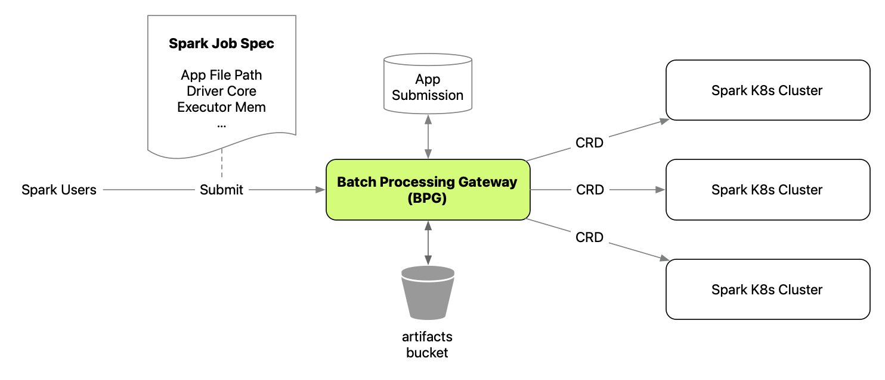
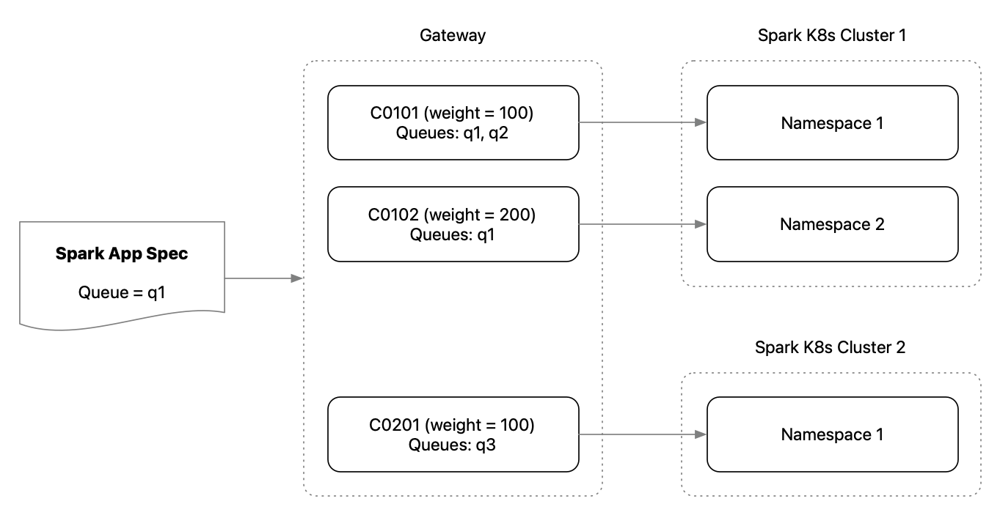
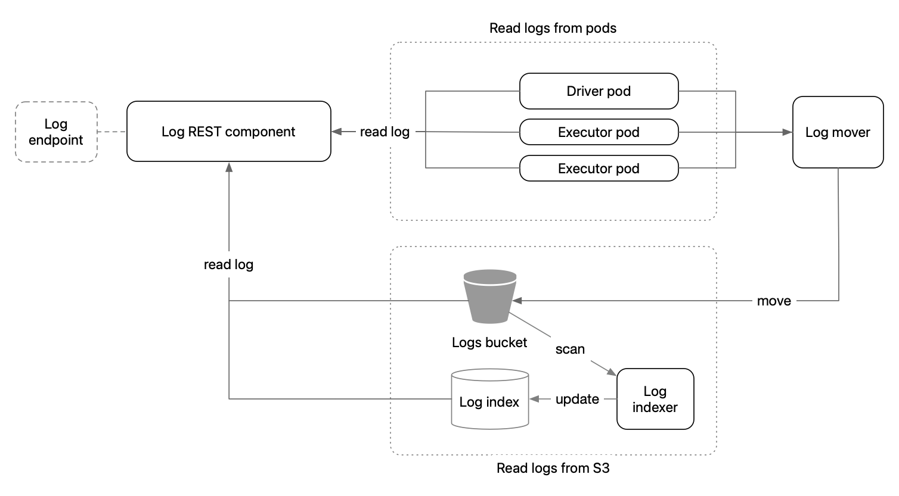

# Batch Processing Gateway

Batch Processing Gateway makes running Spark service on Kubernetes easy.
It allows users to submit, examine and delete Spark apps on Kubernetes with intuitive API calls, without worrying much about what goes on behind the scene.
It can also be configured with many Spark clusters to scale the service horizontally.

## Overview



Batch Processing Gateway (BPG) is the frontend of the entire stack of Spark service, which typically includes one gateway instance and multiple Spark K8s clusters.

A typical flow of Spark application submission:
- Spark users publish the app artifacts (.jar, .py, .zip, etc) to S3 artifacts bucket
- Users compose job spec which includes key information such as job path, driver core, executor memory, etc, and submit it to a REST endpoint.
- BPG parses the request, translates it to a custom resource definition (CRD) supported by [Spark on K8s Operator](https://github.com/GoogleCloudPlatform/spark-on-k8s-operator).
- Using queue and weight based configuration, BPG chooses a Spark K8s Cluster and submits the CRD to it.
- The [Spark on K8s Operator](https://github.com/GoogleCloudPlatform/spark-on-k8s-operator) handles the CRD and submits the Spark app with `spark-submit`.


### Artifacts Bucket

The S3 bucket to hold all the application artifacts, including main app files, dependencies, etc.
BPG exposes the upload API for users to upload the artifacts before launching a Spark app.

### App Submission DB
BPG generates a `Submission ID` as a unique identifier for a submitted app.
When the app gets submitted to Spark K8s cluster, Spark will generate an `Application ID`, which is also a unique identifier.
The App Submission DB maintains the ID mapping, so that users can use both `Submission ID` and `Application ID` to find the app.
A few other metadata fields of the apps are maintained in DB too to enable certain features.

To understand how the App Submission DB is populated, refer to the [Application Monitor](docs/KEY_COMPONENTS.md#application-monitor) section.

#### application_submission schema (partial)

| Field         | Type         | Populated by | Doc                                             |
|---------------|--------------|--------------|-------------------------------------------------|
| submission_id | varchar(255) | Submission   | The unique ID generated by BPG                  |
| user          | varchar(255) | Submission   | The user who submitted the app                  |
| app_name      | varchar(255) | Monitor      | The app name specified in app spec              |
| spark_version | varchar(255) | Submission   | The Spark version specified in app spec         |
| queue         | varchar(255) | Submission   | The queue specified in app spec                 |
| status        | varchar(255) | Monitor      | The latest status of the app                    |
| app_id        | varchar(255) | Monitor      | The unique ID generated by Spark K8s cluster    |
| request_body  | text         | Submission   | The original request body specified by user     |
| created_time  | timestamp    | Submission   | Using system current timestamp (GMT) as default |
| start_time    | timestamp    | Monitor      | The time the app started running (GMT)          |


Refer to [KEY COMPONENTS](docs/KEY_COMPONENTS.md) for more details of the key components in BPG.


## REST Endpoints


BPG exposes REST endpoints to end users / clients for Spark apps, e.g. `POST /skatev2/spark` to submit a Spark app.
The REST components receive the user requests, manipulate the requests when necessary, and interact with Spark clusters via [fabric8](https://github.com/fabric8io/kubernetes-client) Kubernetes client.


## Auth

BPG doesn't have authentication out of the box. It does have a simple config based [User List Authorizer](docs/KEY_COMPONENTS.md#user-list-authorizer).

If you need authentication or more sophisticated authorization, consider building a sidecar container running in parallel with the BPG container, and pass the username to it after successful auth.
This can keep the auth logics decoupled for better maintainability.

BPG supports two ways to pass in the user:
- Basic authentication: the common header `Authorization: Basic <base64-encoded string username:password>`
- A header `USER_HEADER_KEY`: this provides more flexibility when auth is done by other processes


## Spark Cluster Routing

BPG essentially takes requests, and routes them as CRDs to the Spark K8s clusters.
To utilize the Spark clusters according to business needs, it offers the flexibility to route the requests to a particular namespace based on queues and weights.



### Namespace Based Cluster Config

Each Spark cluster configured in BPG maps to a namespace from the actual Spark K8s cluster.
In other words, you are able to configure multiple Spark cluster entries, each mapping to a namespace in a single Spark K8s cluster.
The Spark jobs will be submitted as CRDs to the particular namespaces.
This provides more flexibility to resource allocation.


### Queue Config

Each Spark cluster configured has a list of queues to which the Spark apps can be submitted.
When there's no queue specified, BPG will by default try to submit to a `poc` queue.

When there are multiple Spark clusters supporting a queue, it will choose one cluster based on [weight calculation](#weight-based-cluster-selection).

### Weight Based Cluster Selection

Say when a Spark app is submitted to the queue `q1`, and all the cluster `c01`, `c02` and `c03` support `q1`.
How a cluster gets chosen depends on both the cluster weights and some randomness:

```
The probability of c01 being selected =
weight(c01) / (c01.weight + c02.weight + c03.weight)
```

So if you want one cluster to be selected more often than the others for the same queue, simply increase the weight of that cluster.

## Application Logs



When Spark apps run on a Spark K8s cluster, the application logs from driver and executors are written to the pod local storage.
However, when the pods are gone after the app completes, the logs will be gone as well.
One general way of preserving the logs is to move them to a S3 bucket.

When a user requests driver/executor logs via the log endpoint, BPG will first try to load logs from the driver/executor pods.
If the pods are gone or the logs are not available, it will then read from a pre-configured S3 bucket.

In order for the S3 log storage to work, two things need to be in place:
- A `log mover` to keep moving the Spark app logs from pods to S3
- A `log index` in DB and an `indexer` process to keep track of the S3 prefixes of the log files

Currently, the `log mover` and `indexer` are not part of the scope.
Service maintainers would need to launch their own processes to utilize the S3 log feature.
For `log mover`, one solution is to adopt [fluentbit](https://fluentbit.io).

#### logindex schema (partial)

| Field       | Type         | Doc                                                    |
|-------------|--------------|--------------------------------------------------------|
| logs3key    | varchar(500) | The full path to the log file on S3                    |
| date        | date         | The date on which the job was created                  |
| hour        | char(2)      | The hour on which the job was created                  |
| containerId | varchar(60)  | In the format of `<Submission ID>-<driver/exec-index>` |


## Contributing
Please see [CONTRIBUTING](/CONTRIBUTING.md) for details on how to contribute. To get started on development, refer to the [GETTING STARTED](docs/GETTING_STARTED.md) guide.


## Deployment
In production, typically the Spark apps are run on different Spark K8s clusters, as the Spark apps can be resource demanding.
The deployment of BPG on Kubernetes can be managed by a [Helm chart](/helm/batch-processing-gateway).

## Troubleshoot Spark Cluster
Sometimes if there is issue for Batch Processing Gateway connecting to the underlying Spark Cluster, you could use this tool `SparkClusterTest`
to double-check whether you could connect to the Kubernetes API Server in the Spark Cluster. e.g.
```
java -cp target/bpg-release.jar com.apple.spark.tools.SparkClusterTest -api-server https://xxx -namespace spark-operator -user spark-operator-api-user -token xxx
```

## Built With

Batch Processing Gateway was built with (not limit to):

* [Dropwizard](https://www.dropwizard.io) - The web framework used for REST API
* [Maven](https://maven.apache.org/) - Dependency Management
* [fabric8 K8s Client](https://github.com/fabric8io/kubernetes-client) - Kubernetes Client
* [Micrometer](https://micrometer.io) - Metrics Registry
* [Swagger](https://swagger.io) - OpenAPI and Swagger UI Support
* [AWS SDK for Java](https://aws.amazon.com/sdk-for-java/) - S3 Upload Support


## Public Talks

Public talks at conferences that explain the role of Batch Processing Gateway in a cloud native data platform and best practices:

 - KubeCon North America 2022 - [Beyond Experimental: Spark On Kubernetes](https://www.youtube.com/watch?v=u7htKIiK75c)
 - KubeCon Europe 2022 - [Spark on Kubernetes - The Elastic Story](https://www.youtube.com/watch?v=n7WeoTJq-40&ab_channel=CNCF%5BCloudNativeComputingFoundation%5D)


## License
Please see [LICENSE](/LICENSE) for more information.
