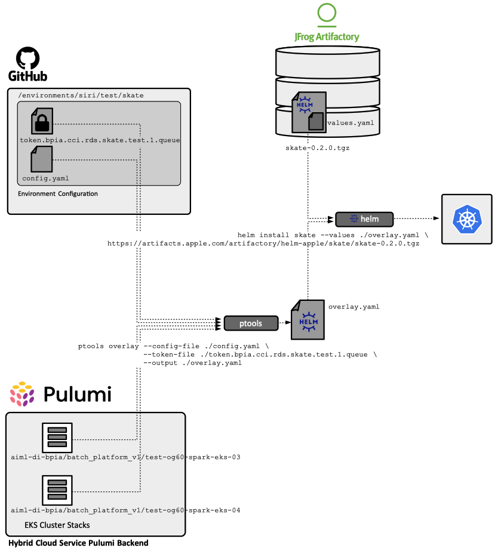

# Skate Helm Chart
## Overview

Series 0.2 charts require a special deployment procedure, described below. The procedure is necessary because Skate expects configuration that is normally provided via ConfigMaps and Secrets to be exposed instead as an `app/app-config.gz` archive file, in the pod filesystem. This behavior will change in the 0.3 series.

All infrastructure required by Skate - the Skate EKS cluster, the RDS instance, the S3 bucket and the dependent Spark EKS clusters - must be provisioned by the infrastructure automation tooling **before** the application deployment.



The Skate Helm chart's `values.yaml` file contains environment-independent configuration, shared by all Skate installation across environments. This includes the Skate container image details, whose version is tied to the chart release, auxiliary container images details, such as CloudTech `app-encryption` and AppleConnect `appleconnect-proxy`, Spark images details, configuration defaults such as memory and CPU, and any other configuration elements that are common across deployments.

The environment-specific configuration, which includes database credentials, Spark cluster configuration details, and any other configuration element that is relevant for a particular environment, are provided via a Helm overlay file that is compiled at **deployment time**.

The series 0.2 deployment automation logic pulls this configuration elements from the [aiml-datainfra/dp-configuration](https://github.pie.apple.com/aiml-datainfra/dp-configuration) configuration repository and Pulumi state, as follows:
* Non-security-sensitive configuration is read from `/environments/<environment-namespace>/skate/config.yaml` (example: `/environments/siri/test/skate/config.yaml`). This includes ingress details, S3 configuration, Spark history server configuration, Ranger configuration and the name of the EKS Spark cluster Pulumi stacks. An example of such a configuration file is available [here](./examples/config-example.yaml).
* Security-sensitive configuration is read from `/environments/<environment-namespace>/skate/<encrypted-token-file>` (example: `/environments/siri/test/skate/token.bpia.cci.rds.skate.test.1.queue`). This file includes configuration elements such as database credentials, queue tokens, and IDMS password. The file is encrypted using symmetric encryption. The encryption key is the same used by Pulumi to protect its stack secrets. The key should be available in the execution environment as the value of the `PULUMI_CONFIG_PASSPHRASE` environment variable. Note that maintaining secretes in encrypted files stored in the repository is not optimal. This mechanism will be replaced with [Whisper](https://pages.github.pie.apple.com/platform-security/whisper/) ([TODO rdar://90185398](rdar://90185398)).
* Skate EKS cluster configuration is obtained from the live Pulumi stack state, via API calls, as part of the overlay creation procedure. See the [Prerequisites](#prerequisites) section for details on how to obtain this value.

The steps to build the deployment overlay are described below, in the [Overlay Generation](#overlay-generation) section.


## Prerequisites

* Python 3.9 or newer.
* Helm 3.8.0 or newer.
* The newest HCS Pulumi. For installation details, see [HCS Pulumi Support for Data Platform Automation](https://github.pie.apple.com/aiml-datainfra/automation/blob/develop/doc/hcs-pulumi.md).
* `PULUMI_CONFIG_PASSPHRASE` environment variable must be set in the execution environment. The value can be obtained from [here](https://apple.box.com/s/nyd673dl901gxklkn2l0manbvisa51be). This is the same symmetric encryption key used by Pulumi to encrypt BPIA secrets. If the environment has a wrong `PULUMI_CONFIG_PASSPHRASE` value, configuration tool will react with a `cryptography.fernet.InvalidToken` error message.

## Overlay Generation

Clone the Skate repository https://github.pie.apple.com/aiml-datainfra/skate. We'll refer to the root of local Skate workarea as `$SKATE_HOME`.

Clone the DP configuration repository https://github.pie.apple.com/aiml-datainfra/dp-configuration. We'll refer to the root of local dp-configuration workarea as `$DP_CONFIG_HOME`.

Configure this deployment by adjusting the configuration values from `$DP_CONFIG_HOME/environments/<environment-namespace>/skate/config.yaml` (example: `$DP_CONFIG_HOME/environments/siri/test/skate/config.yaml`). The file is typically used to configure the number of replicas, the Skate ingress endpoint and TLS secret, AppleConnect details, the S3 storage details, Spark History Server details, the Ranger environment, Spark images and the name of the Pulumi stacks to get Spark EKS configuration from.

Execute:
```text
export PATH=$SKATE_HOME/src/main/python:${PATH}
export PULUMI_CONFIG_PASSPHRASE=<bpia-pulumi-config-passphrase>
cd $DP_CONFIG_HOME/environments/<environment-namespace>/skate
ptools clean
ptools overlay --config-file ./config.yaml --token-file ./<token-file> --output ./overlay.yaml
```
An intermediary Skate configuration file, which can be useful for debugging, is generated as `$SKATE_HOME/target/helm/skate-config.yaml`. More details on `ptools` usage can be obtained from its in-line help:
```text
ptools help
```

## Chart Deployment

In the `$DP_CONFIG_HOME` directory where you created the overlay run:
```text
helm upgrade --install skate \
 -n skate \
 -f ./overlay.yaml \
 $SKATE_HOME/src/main/helm/skate
```

or

```text
helm upgrade --install skate \
 -n skate \
 -f ./overlay.yaml \
 https://artifacts.apple.com/artifactory/helm-apple/skate/skate-0.2.0.tgz
```
