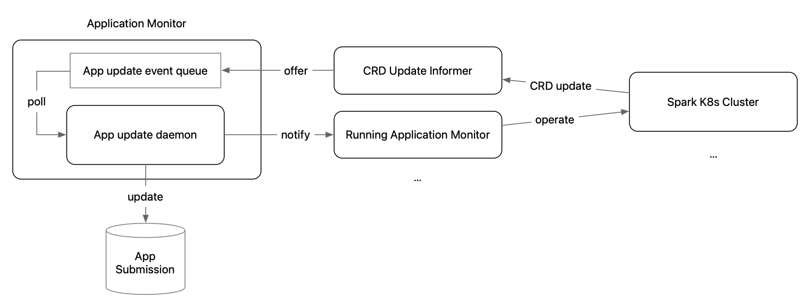

# Key Components

## Application Monitor

Application Monitor keeps the App Submission DB updated with the latest application state, and launch the sub-processes that monitor the running jobs on each Spark cluster.
Here's how the flow looks like:

Currently, the Application Monitor needs to reside as part of singleton application instance (in Helm chart, it is in the `bpg-helper` deployment).
To start the application with the Application Monitor daemon thread, specify `APP_MONITOR_ENABLED=true`.

## User List Authorizer

The user list authorizer ensures a user:
- is not on the configured blocked users list (this can help quickly block some malicious users)
- is on the allowed users list (can be wildcard)

> Currently, the user list authorizer is implemented in the `UserNameBasicAuthenticator` for simplicity, since no role is involved here.
